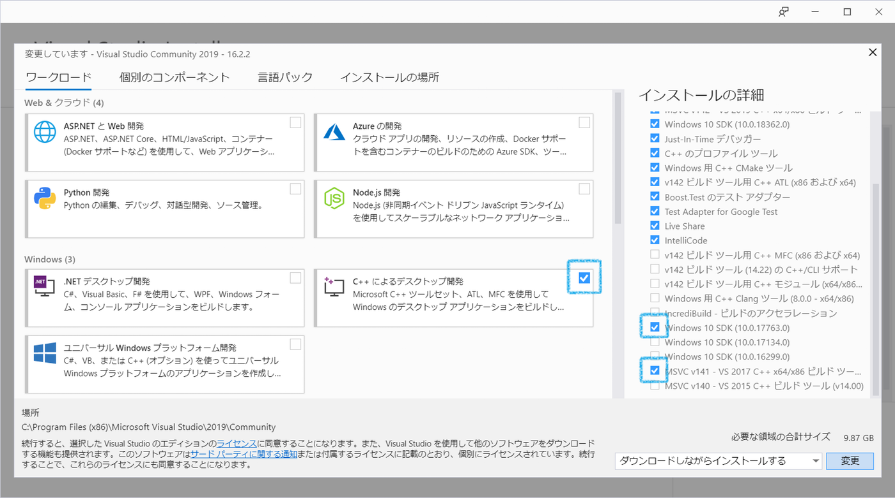

## 構築手順

1. 下記をインストールし、必要に応じてPATHを通す

- flutter SDK
    - https://flutter.dev/docs/development/tools/sdk/releases

- Dart for windows (SDK)
    - https://gekorm.com/dart-windows/

※ モバイルアプリのみだとFlutterのSDKだけでいいが、webアプリも開発する場合は Dart for windows（SDK）をインストールする必要あり


2. 以下コマンドを実行 (以下のようにすべて✓となればOK)

```
$ flutter doctor

Doctor summary (to see all details, run flutter doctor -v):
[√] Flutter (Channel master, v1.14.7-pre.58, on Microsoft Windows [Version 10.0.18362.592], locale ja-JP)
 
[√] Android toolchain - develop for Android devices (Android SDK version 29.0.2)
[√] Chrome - develop for the web
[√] Visual Studio - develop for Windows (Visual Studio Community 2019 16.4.4)
[√] Android Studio (version 3.5)
[√] IntelliJ IDEA Community Edition (version 2019.3)
[√] IntelliJ IDEA Ultimate Edition (version 2019.3)
[√] Connected device (3 available)

• No issues found!
```

※ここではAndroid SDKが必要なためAndroid StudioのインストールやIntelliJやVSCodeのプラグインをインストールすることが求められる

## web(chrome)でビルドの場合
チャンネルをベータ版に切り替え、webサポートを有効化する<br>
※公式ではベータ版と記載あったが、実際はマスターでもいけた

```
$ flutter channel beta
$ flutter upgrade
$ flutter config --enable-web

$ cd myapp
$ flutter run -d chrome
```
※Windowsの場合はBITS transferを使用するためPowershellで実行しないとエラーとなる

## デスクトップアプリ版でビルドの場合

### 事前準備
VisualStudioをインストール<br>
※オプションは以下の画像を参照



### ビルド
```
$ flutter channel master
$ flutter upgrade
$ flutter config  --enable-windows-desktop

$ cd myapp
$ flutter run -d windows
```


## プロジェクト構成
参考記事：https://qiita.com/tatsu/items/73eccd8f6d340dd8e3b0

windowsアプリ版はまだ開発途中のため、別途ビルド用のディレクトリ(windows/linux/macos/fonts)が必要

https://github.com/google/flutter-desktop-embedding
